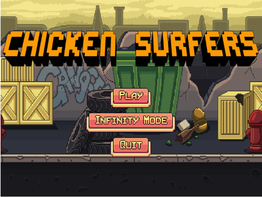
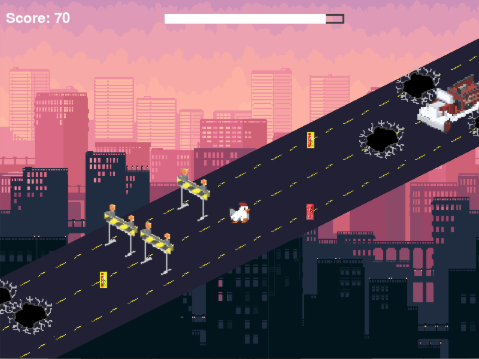
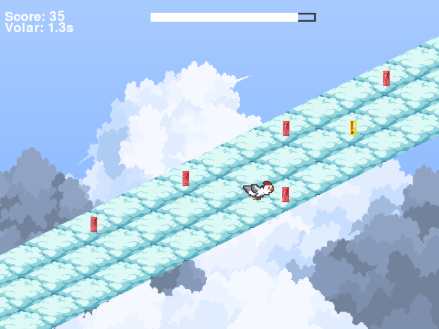
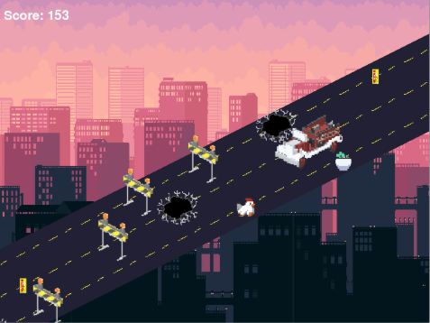
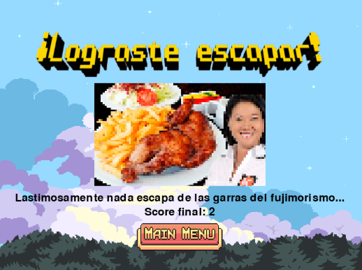
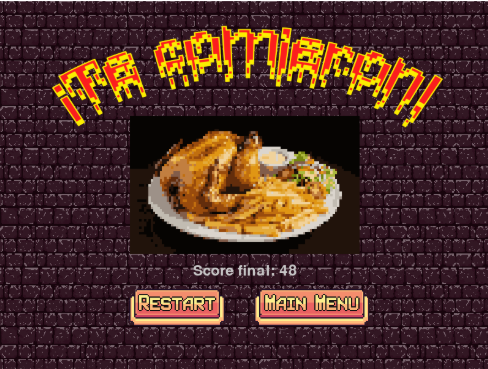

# Chicken Surfers

## Premisa
Eres un pequeño pollo que tuvo la mala suerte de cruzarse con un estudiante de Ciencias de la Computación en un país latinoamericano sin salida laboral que tiene demasiada hambre. Tu objetivo es escapar de este desesperado y desafortunado joven antes que te haga un pollo a la brasa con papas fritas.

## Controles
- Moverse usando las flechas direccionales (🡰) y (🡲).
- Saltar usando flecha hacia arriba (🡱).
- Dar una voltereta usando la flecha hacia abajo (🡳).

## Instrucciones de juego 
Para instalar el juego se siguen las siguientes instrucciones:

1. Instalación de entorno virtual e instalación de dependencias.
```sh
uv venv
source .venv/bin/active
uv sync
```

2. Incio de juego
```sh
chmod +x run.sh
./run.sh
```
## Menú de Inicio



## Modo Normal





## Modo Infinito



## Pantalla de Ganaste



## Pantalla de Perdiste


